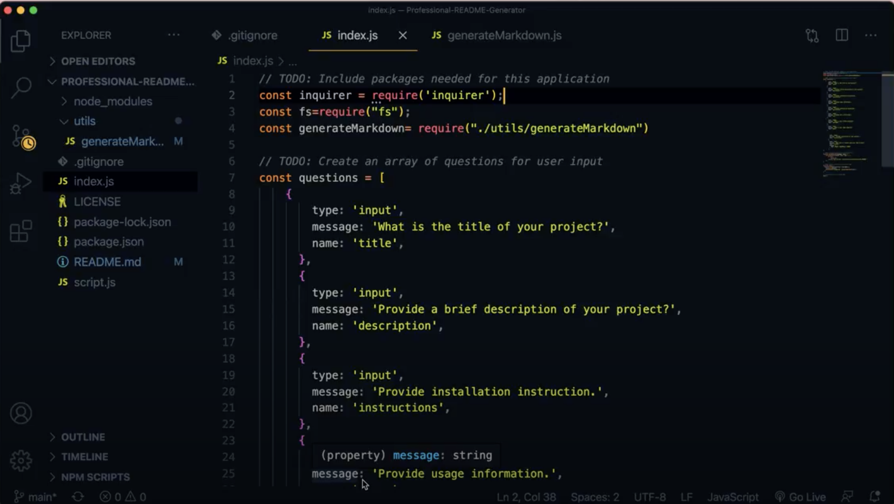

# README File Generator
  # README
  
  * [Instructions](#instructions)
  * [Description](#description)
  * [Installation](#installation)
  * [Test](#tests)
  * [Usage](#usage)
  * [Github Username](#github)
  * [Email](#email)
  
  * [License](#license) 

  ## License 
  
  This application is licensed under the MIT license.
  

  ## Instructions
Open your terminal then access your index.js file through node. You will be promoted a list of questions to answer. Once you answer all of the questions, your README file will be generated.
   

  # Description
This app creates a README.md file through the command-line application. 

  # Installation
  Make sure to install node.js

  # Tests
  There are no tests set at this time.
  
  # Usage
  N/A

  # Github
  Github username:rayaalsaedi

  # Email
  rayaheen@uw.edu

  # Visual Illustration
  
